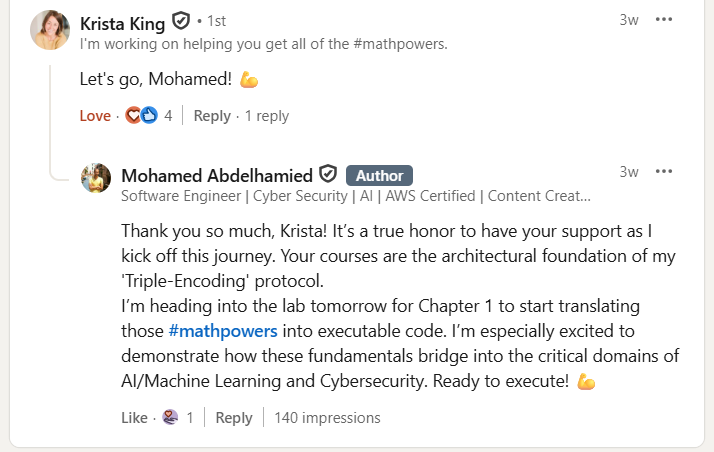
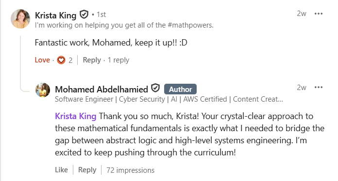

# 📐 Mathematics: The Engineering DNA

> "To understand the machine, one must first master the logic that dictates its existence."  
> This repository documents the rigorous pursuit of mathematical foundations, bridging abstract concepts into the core of Software Architecture, Cybersecurity, and Artificial Intelligence.

---

## 🏗️ The Engineering Methodology: Triple-Sync
Every mathematical module follows a strict synchronization process to ensure that abstraction is converted into functional intuition:
1. **Analog (Logic):** Handwritten decomposition and geometric proofs in physical notebooks.
2. **Digital (Proof):** Jupyter Lab simulations using Python to stress-test mathematical theorems.
3. **Applied (Bridge):** Mapping every concept to one of the **6 Engineering Bridges** (Linux, Security, CPU, AI, Cloud, Software).

---

## 🗺️ Curriculum Roadmap

### 📂 [1. Master Fundamentals of Math](./1.Master%20the%20Fundamentals%20of%20Math)
*Focus: Arithmetic, Algebra, and the Intuition of Logic.*
*   **Status:** 🏃 In Progress (Sprint Phase)
*   **Key Asset:** The 6-Bridge Framework (Connecting Numbers to Register Logic).
*   **Source:** [Krista King Pre-Algebra](https://courses.kristakingmath.com/library/pre-algebra-39669/110489/about/)

### 📂 [2. Algebra 1 & 2](#)
*Focus: Advanced equations, functions, and algebraic structures.*
*   **Status:** ⏳ Next Up
*   **Source:** [Krista King Algebra 1](https://courses.kristakingmath.com/library/algebra-1-44446/110490/about/)
*   **Source:** [Krista King Algebra 2](https://courses.kristakingmath.com/library/algebra-2-44453/110492/about/)

### 📂 [3. Linear Algebra](#)
*Focus: Vector spaces, matrices, and high-dimensional transformations for AI.*
*   **Status:** ⏳ Upcoming
*   **Source:** [Krista King Linear Algebra](https://courses.kristakingmath.com/library/linear-algebra-46017/110506/about/)

---

## 🌉 The 6-Bridge Framework
Every concept in this domain is validated against 6 distinct engineering pillars to ensure permanent retention:

| Bridge | Application |
| :--- | :--- |
| **Linux/Kernel** | Permissions, Flags, and Binary Logic. |
| **Cybersecurity** | XOR Ciphers, Encryption, and Entropy. |
| **CPU Architecture** | Sign Flags, Register Logic, and Overflow. |
| **Software Arch** | Validation, Decorators, and Big O Notation. |
| **AI & ML** | Weight Activation and Error Margins. |
| **Cloud Infra** | SLA Monitoring and Billing Offsets. |

---

## 📈 Global Visibility & Industry Validation
This mathematical approach to engineering is recognized for its depth and "Slow Burn" methodology. 

### 🌟 Educator Endorsement

  
   
  <em>Direct encouragement from Krista King on the bridging of abstract logic and systems engineering.</em>

  
   
  <em>Direct validation from Krista King of the 'Triple-Sync' methodology.</em>

### 🏢 Industry Engagement
Engagement and visibility from professionals at:
* **The "Big Tech" Tier:** Google, Amazon, IBM.
* **Specialized Research:** Krista King (Validated Triple-Sync Framework).
* **Global Consulting:** Deloitte, Accenture, EY.

---

[← Back to Root](/README.md)
