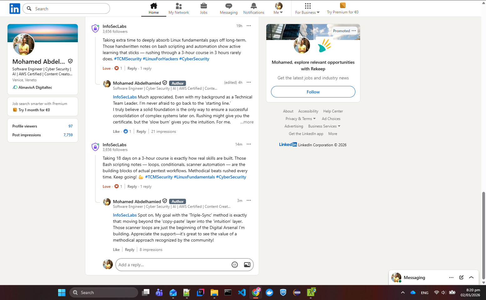

# 🛡️ Cybersecurity: The Digital Arsenal

> "A solid foundation means a success consolidation." 
> This repository documents the journey from fundamental principles to complex system exploitation and defense, focusing on the internal engines rather than just the surface-level tools.

---

## 🏗️ The Engineering Methodology: Triple-Sync
Every module in this domain follows a strict synchronization process to ensure the "Slow Burn" translates into permanent intuition:
1. **Analog (Logic):** Handwritten decomposition of concepts to bake logic into muscle memory.
2. **Digital (Command Center):** Jupyter Lab & Markdown documentation for rapid execution and reference.
3. **Mathematical (DNA):** Mapping security logic back to algebraic variables and set theory.

---

## 🗺️ Curriculum Roadmap

### 📂 [Linux 100 Fundamentals](./1.%20Linux%20100%20Fundamentals)
*Focus: Mastering the OS Kernel, Bash Scripting, and Automation.*
*   **Status:** ✅ Completed (18-Day Deep Build)
*   **Key Asset:** Custom Automation Engine for Network Discovery.
*   **Source:** [TCM Security Linux 100 Fundamentals](https://tcm-sec.com/academy/linux-100-fundamentals/)

### 📂 [Programming 100 Fundamentals](#)
*Focus: Logic and implementation for security professionals.*
*   **Status:** ⏳ Upcoming
*   **Source:** [TCM Security Programming 100 Fundamentals](https://tcm-sec.com/academy/programming-100-fundamentals/)

### 📂 [Linux 101](#)
*Focus: Advanced systems administration and security hardening.*
*   **Status:** ⏳ Upcoming
*   **Source:** [TCM Security Linux 101](https://tcm-sec.com/academy/linux-101/)

---

## 📈 Industry Validation
This journey is tracked and validated by industry leaders. This methodology has gained visibility and engagement from professionals at:
* **The "Big Tech" Tier:** Google, Amazon, IBM.
* **Cybersecurity Elite:** CrowdStrike, HackerOne, Bugcrowd, TCM Security.
* **Specialized Research:** InfoSecLabs (Validated Manual Methodology & Automation Loops).
* **Global Consulting:** Deloitte, Accenture, EY, Tata Consultancy Services.
---
### 🛡️ Proof of Methodology

  
   
  <em>Validation of the 'Triple-Sync' methodology and automation engine by InfoSecLabs practitioners.</em>

---

[← Back to Root](/README.md)
